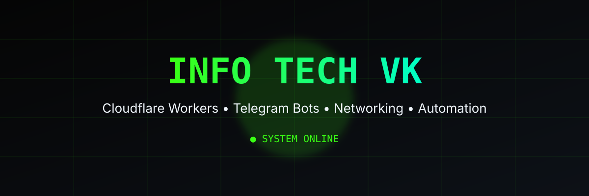

# InfoTech_VK

 

<h1 align="center">
InfoTech_VK
</h1>

ساخت ابزارهای متن‌باز در حوزه شبکه، اتوماسیون، Cloudflare و تلگرام

---

## 👋 About Me

سلام 👋

من سازنده **InfoTech_VK** هستم.

هدف من توسعه ابزارهای کاربردی، پروژه‌های متن‌باز و راهکارهای تکنولوژی برای اینترنت آزاد، اتوماسیون و توسعه‌دهندگان است.

---

## 🎯 Mission

تمرکز اصلی InfoTech_VK:

- 🌐 Open Internet Technologies
- ☁️ Cloudflare Workers
- 🤖 Telegram Bots
- ⚙️ Automation Tools
- 🔐 Networking Solutions
- 💻 Open Source Projects

---

## 🛠️ Tech Stack

### ☁️ Cloud & Backend

### 🔧 Tools & Platforms

---

<h1 align="center">
🚀 Featured Projects
</h1>

Selected projects by InfoTech_VK

 

<table align="center">

<tr>

<td width="50%">

<h3 align="center">
🤖 InfoTech_VK Bot
</h3>

Telegram automation platform

  

Smart publishing system,
content management,
and bot automation.

  

</td>

<td width="50%">

<h3 align="center">
☁️ Cloudflare Projects
</h3>

Serverless applications using

Cloudflare Workers

  

Fast,
secure,
and scalable edge solutions.

  

</td>

</tr>

<tr>

<td width="50%">

<h3 align="center">
🌐 Networking Tools
</h3>

Open Internet tools

  

Solutions focused on networking,
connectivity and accessibility.

  

</td>

<td width="50%">

<h3 align="center">
⚙️ Automation Systems
</h3>

Automated workflows

  

Tools that reduce manual work
and improve productivity.

  

</td>

</tr>

</table>

---

<h1 align="center">
📊 GitHub Analytics
</h1>

GitHub statistics will be added with GitHub Actions.

---

# 🐍 Contribution Snake

Coming Soon...

---

# 🚀 Current Goals

- Building open-source projects
- Creating useful Telegram bots
- Developing Cloudflare Workers applications
- Improving networking tools
- Learning modern infrastructure technologies

---

# 📚 Learning

Currently exploring:

- Cloudflare Edge Computing
- Serverless Architecture
- Automation Systems
- Advanced Networking
- Open Source Development

---

# 🌍 Connect

---

<strong>
InfoTech_VK | اینترنت آزاد
</strong>

 

Building technology for a more open internet.

